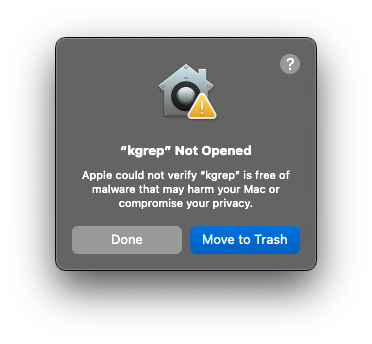
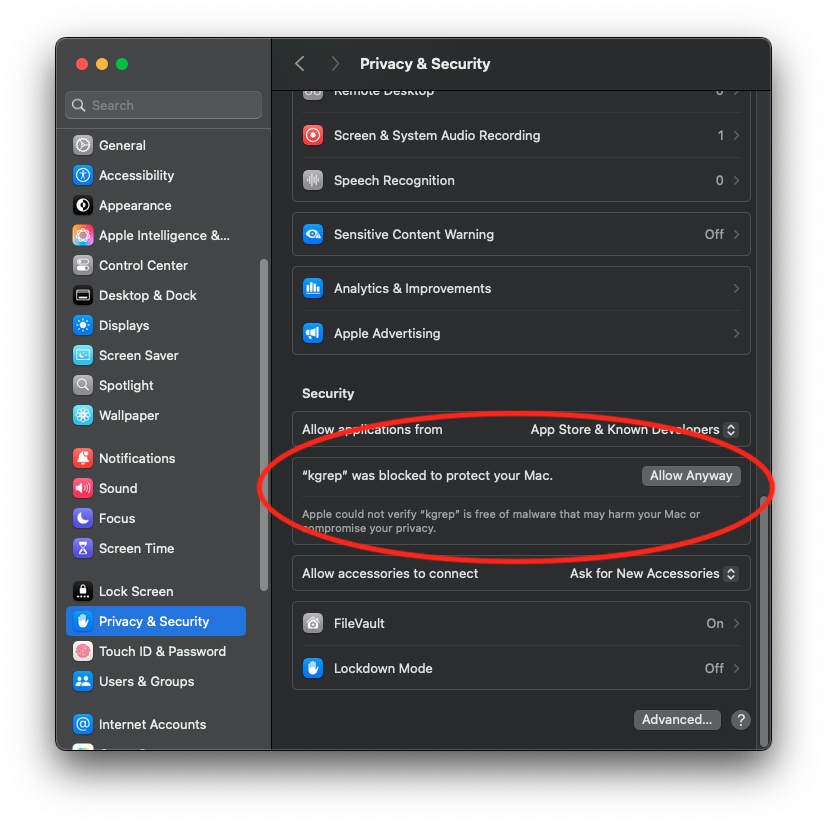
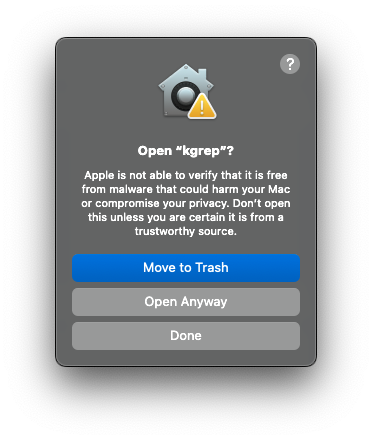

# kgrep

[](LICENSE)
[](https://github.com/hbelmiro/kgrep/actions/workflows/unit-tests.yaml)
[](https://github.com/hbelmiro/kgrep/actions/workflows/integration-tests.yaml)
[](https://github.com/hbelmiro/kgrep/releases)
[](https://deepwiki.com/hbelmiro/kgrep)

`kgrep` is a command-line utility designed to simplify the process of searching and analyzing logs and resources in Kubernetes. Unlike traditional methods that involve printing resource definitions and grepping through them, `kgrep` allows you to search across multiple logs or resources simultaneously, making it easier to find what you need quickly.

---

## Table of Contents

- [Why kgrep?](#why-kgrep)
- [Key Features](#key-features)
- [Installation](#installation)
- [Usage](#usage)
- [Building the Project](#building-the-project)
- [Running the Application in Dev Mode](#running-the-application-in-dev-mode)
- [Building the Application](#building-the-application)
- [Installing the Application](#installing-the-application)
- [Cross-compiling for Different Platforms](#cross-compiling-for-different-platforms)
- [Creating Releases](#creating-releases)
- [Version Information](#version-information)
- [Makefile Targets](#makefile-targets)
- [Contributing](#contributing)
- [License](#license)
- [Contact](#contact)

---

## Why kgrep?

Searching Kubernetes resources and logs with `kubectl` and `grep` can be tedious and error-prone, especially across multiple namespaces or resource types. `kgrep` streamlines this process by providing a single, powerful CLI for searching logs and resources, supporting pattern matching, namespace selection, and more. This saves time and reduces the risk of missing important information.

## Key Features

* **Resource Searching**: Search the content of Kubernetes resources such as `ConfigMaps`, `Secrets`, `Pods`, and `ServiceAccounts` for specific patterns within designated namespaces.
* **Log Searching**: Inspect logs from a group of pods or entire namespaces, filtering by custom patterns to locate relevant entries.
* **Namespace Specification**: Every search command supports namespace specification, allowing users to focus their queries on particular sections of their Kubernetes cluster.
* **Pattern-based Filtering**: Utilize pattern matching to refine search results, ensuring that only the most pertinent data is returned.

## Installation

### Prerequisites

- [kubectl](https://kubernetes.io/docs/tasks/tools/install-kubectl/) installed and configured to connect to your Kubernetes cluster.
- Go 1.24+ (for building from source)

### Homebrew (macOS/Linux)

Install `kgrep` using [Homebrew](https://brew.sh):

```sh
brew tap kgrep-org/kgrep
brew install kgrep
```

Or install directly without adding the tap:

```sh
brew install kgrep-org/kgrep/kgrep
```

For more information about the Homebrew tap, visit [homebrew-kgrep](https://github.com/kgrep-org/homebrew-kgrep).

### Download the binary and add it to your PATH

Download a release from https://github.com/hbelmiro/kgrep/releases, uncompress it, and add it to your PATH.

<details>
<summary>⚠️ Unverified app warning on macOS</summary>

You can see this warning when trying to run `kgrep` for the first time on macOS.

```
"kgrep" Not Opened
Apple could not verify "kgrep" is free of malware that may harm your Mac or compromise your privacy.
```



If you see that, click "Done" and allow `kgrep` to run in macOS settings, like the following screenshot.



When you try to run it again, you'll see a final warning. Just click "Open Anyway" and it won't warn you anymore.



</details>

## Usage

Type `kgrep --help` to check all the commands and options.

### Search for a pattern in ConfigMaps in a namespace
```sh
kgrep configmaps -n my_namespace -p "example"
```

### Search for a pattern in all Secrets
```sh
kgrep secrets -p "password"
```

### Search for a pattern in Pod logs in a specific namespace
```sh
kgrep logs -n my-namespace -p "error"
```

### Search for a pattern in ServiceAccounts
```sh
kgrep serviceaccounts -n my-namespace -p "my-service-account"
```

### Search for a pattern in any resource kind (generic)
```sh
kgrep resources --kind Deployment --pattern "replicas: 3" --namespace my-namespace
```

### Example Output
```
configmaps/example-config-4khgb5fg64[7]:     internal.config.kubernetes.io/previousNames: "example-config-4khgb5fg64"
configmaps/example-config-4khgb5fg64[48]:   name: "example-config-4khgb5fg64"
configmaps/example-config-5fmk4f7h8k[7]:     internal.config.kubernetes.io/previousNames: "example-config-5fmk4f7h8k"
configmaps/example-config-5fmk4f7h8k[57]:   name: "example-config-5fmk4f7h8k"
configmaps/acme-manager-config[104]:     \  frameworks:\n  - "batch/job"\n  - "example.org/mpijob"\n  - "acme.io/acmejob"\
configmaps/acme-manager-config[105]:     \n  - "acme.io/acmecluster"\n  - "jobset.x-k8s.io/jobset"\n  - "example.org/mxjob"\
configmaps/acme-manager-config[106]:     \n  - "example.org/paddlejob"\n  - "example.org/acmejob"\n  - "example.org/tfjob"\
configmaps/acme-manager-config[107]:     \n  - "example.org/xgboostjob"\n# - "pod"\n  externalFrameworks:\n
```

---

## Building the Project

This project is written in Go and uses the Cobra library for CLI commands.

## Running the Application in Dev Mode

You can run the application in development mode using:
```sh
go run main.go
```

## Building the Application

You can build the application using:
```sh
go build -o kgrep
```
This will produce a `kgrep` executable in the current directory.

## Installing the Application

You can install the application to your GOPATH using:
```sh
go install
```

## Cross-compiling for Different Platforms

Go makes it easy to cross-compile for different platforms:

For Linux:
```sh
GOOS=linux GOARCH=amd64 go build -o kgrep-linux-amd64
```

For macOS:
```sh
GOOS=darwin GOARCH=amd64 go build -o kgrep-darwin-amd64
```

For Windows:
```sh
GOOS=windows GOARCH=amd64 go build -o kgrep-windows-amd64.exe
```

## Creating Releases

This project uses a tag-based release system that automatically builds and publishes binaries when you push a Git tag.

### Prerequisites

- Make sure you have the latest changes committed
- Ensure all tests pass: `go test ./...`

### Creating a New Release

1. **Create a release tag and build:**
   ```sh
   ./scripts/release.sh create 1.0.0
   ```
   This will:
   - Run all tests
   - Create a Git tag (e.g., `v1.0.0`)
   - Build the release binary with version information
   - Show you the next steps

2. **Push the tag to trigger the GitHub Actions release:**
   ```sh
   git push origin v1.0.0
   ```

3. **GitHub Actions will automatically:**
   - Build binaries for Linux and macOS (amd64/arm64)
   - Create a GitHub release
   - Upload the binaries to the release

### Building for Existing Tags

If you need to rebuild a release for an existing tag:

```sh
# Build for the latest tag
./scripts/release.sh latest

# Build for a specific tag
./scripts/release.sh build v1.0.0
```

### Development Builds

For development builds:

```sh
# Development build with "dev" version
make build-dev

# Or using the Makefile
go build -ldflags "-X github.com/hbelmiro/kgrep/cmd.Version=dev ..." -o kgrep
```

### Available Release Commands

```sh
# Show all available commands
./scripts/release.sh help

# List all available tags
./scripts/release.sh list

# Clean build artifacts
./scripts/release.sh clean
```

## Version Information

The built binaries include version information that can be displayed with:

```sh
./kgrep version
```

This shows:
- Version number (from Git tag or "dev" for development builds)
- Build timestamp
- Git commit hash

## Makefile Targets

You can also use Makefile targets for building and release automation:

```sh
# Development build
make build-dev

# Build for latest tag
make build-tag

# Build for specific tag
make build-tag-version TAG=v1.0.0

# Create new tag and build
make tag-and-build VERSION=1.0.0

# List available tags
make list-tags

# Clean build artifacts
make clean

# Run unit tests
make test

# Run integration tests (requires kubectl access)
make test-integration

# Run integration tests with kind (creates local cluster)
make test-integration-kind
```

---

## Testing

This project includes both unit tests and integration tests:

### Unit Tests

Unit tests use mocked Kubernetes clients and can be run without a real cluster:

```sh
# Run unit tests
make test

# Or directly with go
go test ./...
```

### Integration Tests

Integration tests require a real Kubernetes cluster and test end-to-end scenarios:

```sh
# Run integration tests with your current kubectl context
make test-integration

# Run integration tests with a temporary kind cluster (recommended)
make test-integration-kind
```

For more details about integration tests, see [test/integration/README.md](test/integration/README.md).

## Contributing

Contributions are welcome! To get started:

1. Fork this repository and clone your fork.
2. Create a new branch for your feature or bugfix.
3. Make your changes and add tests if applicable.
4. Open a pull request describing your changes.

Please ensure your code follows the existing style and passes all tests:
```sh
# Run unit tests
make test

# Run integration tests (optional but recommended)
make test-integration-kind
```

---

## License

This project is licensed under the [Apache 2.0 License](LICENSE).

---

## Contact

- Issues and feature requests: [GitHub Issues](https://github.com/hbelmiro/kgrep/issues)
- Maintainer: [@hbelmiro](https://github.com/hbelmiro)
